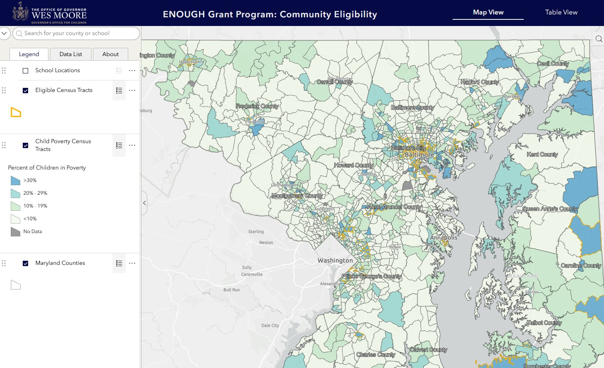
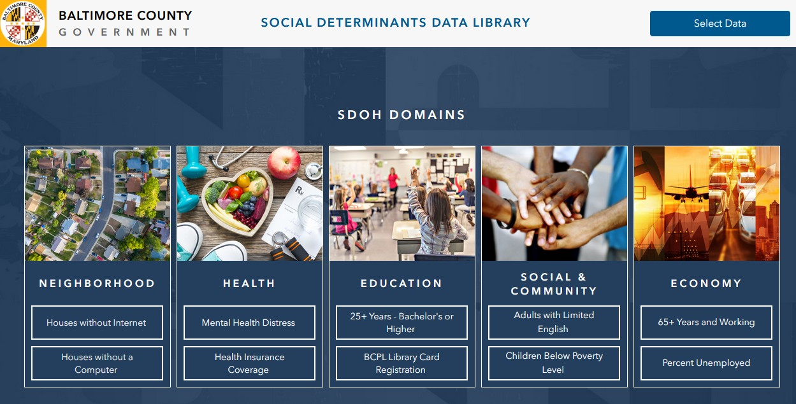
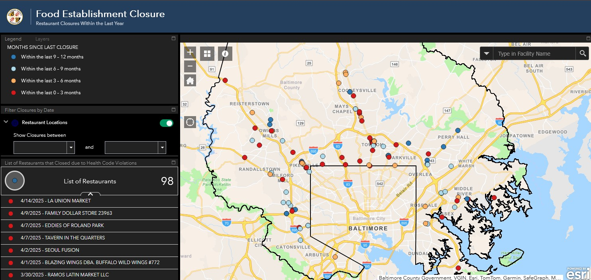

<h1>Professional Work</h1>
<ul>
     <a href="https://experience.arcgis.com/experience/8b24a4ffb5ee4670af96d7b174c1933b" target="_blank" rel="noopener noreferrer">
        <h3>ENOUGH Grant Program Community Eligibility Tool</h3>
      </a>
  

    
    

      

        The ENOUGH Grant Program Community Eligibility Tool supports anti-poverty initiatives across urban, suburban, and rural communities in Maryland. It identifies eligible areas based on two criteria: At least one U.S. Census tract with over 30% of children living in poverty. A Maryland community school with a concentration of poverty of at least 80%.  
      

    

  

      <a href="https://experience.arcgis.com/experience/48745860e33843ab8929ac587a745d96" target="_blank" rel="noopener noreferrer">
        <h3>Baltimore County Social Determinants of Health (SDOH)</h3>
      </a>
  

    
    

      

        The Baltimore County Social Determinants of Health (SDOH) application is an interactive tool that visualizes the factors influencing health and quality of life in the community. It integrates data from local, state, and federal sources, including the U.S. Census Bureau and the Environmental Protection Agency, and is organized around the five key domains of Healthy People 2030.
      

    

      

      <a href="https://bc-gis.maps.arcgis.com/apps/webappviewer/index.html?id=b962ecb3984e419e89d7406c9eb80a7b" target="_blank" rel="noopener noreferrer">
        <h3>Baltimore County Restaurant Closure Dashboard</h3>
      </a>
  

    
    

      

        The Food Establishment Closure Dashboard is an interactive tool that highlights establishments closed due to critical health violations identified during inspections. Users can explore public data, including establishment names, closure dates, reasons for closure, and reopen dates, by selecting locations on the map or from a list. This tool helps promote transparency and public awareness of food safety standards in the community.
      

    

  

  
</ul>

---

<h2>Research Projects</h2>

### [Examing Electrical Vehicle Charging Station Coverage in Travis County, Texas](/Texas_EV_Stations/index.md)

Proposing new prospective locations for electrical vehicle charging stations through the use of user/location demand model and GIS network analysis

<h2>Notable Courses Taken at Penn State University</h2>

<ul>
  <li><a href="https://www.e-education.psu.edu/geog865/node/25" target="_blank" rel="noopener noreferrer"><b>Cloud and Server GIS</b></a>: Learning how to set up cloud services for creating maps, cloud services for managing spatial data, and cloud services for processing spatial data</li>
 
 <li><a href="https://www.e-education.psu.edu/geog586/node/508" target="_blank" rel="noopener noreferrer"><b>Geographic Information Analysis</b></a>: Choosing and applying analytical methods for geospatial data, including point pattern analysis, interpolation, surface analysis, overlay analysis, and spatial autocorrelation</li>
 
 <li><a href="https://www.e-education.psu.edu/geog583/node/25" target="_blank" rel="noopener noreferrer"><b>Geospatial Analysis and Design</b></a>: Researching current GIS systems, how they are designed and evaluated, and how emerging technologies may impact their design and implementation in the near future</li>
 
 <li><a href="https://www.e-education.psu.edu/geog871/home.html" target="_blank" rel="noopener noreferrer"><b>Geospatial Technology Project Management</b></a>: Planning and managing GIS projects and other information technology projects</li>
 
 <li><a href="https://www.e-education.psu.edu/geog580/node/508" target="_blank" rel="noopener noreferrer"><b>Geovisual Analytics</b></a>: Researching the of science of analytical reasoning mediated through human-centered interactive geographic visualization and computational methods</li>
 
 <li><a href="https://www.e-education.psu.edu/geog484/node/1776" target="_blank" rel="noopener noreferrer"><b>GIS Database Management</b></a>: Developing geodatabases, schemas, domains, attribute rules, and contingent values in ArcGIS to assist with workflows</li>
 
 <li><a href="https://www.e-education.psu.edu/geog485/node/91" target="_blank" rel="noopener noreferrer"><b>GIS Programming and Software Development</b></a>: Creating custom geoprocessing tools using ArcGIS Python API</li>
 
 <li><a href="https://www.e-education.psu.edu/geog863/node/1776" target="_blank" rel="noopener noreferrer"><b>Web Application Development for Geospatial Professionals</b></a>: Building applications using the core web technologies of HTML, CSS, and JavaScript. Implementing of 2D maps and 3D scenes for projects, understanding API documentation, layer discovery and visualization, user interface development, data querying, and geoprocessing.</li>
 </ul>

  

  

---

